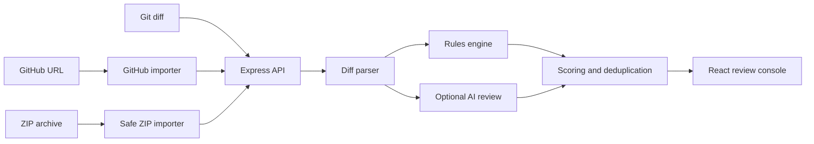

<div align="center">

# ReviewPilot

### Automated code review for diffs, GitHub repositories, and ZIP projects.

ReviewPilot combines deterministic security checks with optional AI analysis to produce line-accurate findings, suggested fixes, file-risk scores, and merge recommendations.

[](https://www.typescriptlang.org/)
[](https://react.dev/)
[](https://expressjs.com/)
[](#testing)
[](./LICENSE)

</div>

---

## What it does

- Reviews unified Git diffs with accurate new-file line numbers
- Imports GitHub repositories, pull requests, commits, and comparisons
- Reviews source projects uploaded as ZIP archives
- Detects exposed secrets, injection risks, unsafe evaluation, XSS, weak tokens, swallowed errors, and type-safety bypasses
- Adds optional context-aware AI review using the developer's OpenAI API key
- Produces severity, confidence, suggested fixes, file risk, and merge verdicts
- Supports configurable rules, review strictness, and repository instructions
- Keeps API keys and GitHub tokens out of server-side storage

## Supported inputs

| Input | Behavior |
| --- | --- |
| Unified diff | Reviews added lines from a pasted Git patch |
| GitHub repository | Reviews the latest commit on the default branch |
| GitHub pull request | Reviews the complete pull-request diff |
| GitHub commit | Reviews the selected commit |
| GitHub comparison | Reviews a branch or tag comparison |
| ZIP archive | Reviews supported source files as a new-code snapshot |

ZIP uploads support archives up to 12 MB and 120 source files. Dependencies, build output, Git metadata, lockfiles, binaries, and unsafe paths are excluded automatically.

## Quick start

Requirements:

- Node.js 20+
- npm 10+

```bash
git clone https://github.com/YOUR_USERNAME/reviewpilot.git
cd reviewpilot
npm install
npm run dev
```

Open [http://localhost:5173](http://localhost:5173).

Select **Load demo PR** to run a review without an API key.

## Optional AI review

ReviewPilot works without external AI through its deterministic rules engine.

For deeper semantic analysis, select **Add API key** inside the application and provide an OpenAI API key. The key is:

- Stored only in the current browser tab
- Sent only with review requests
- Never persisted by the backend
- Redacted from server errors

Private GitHub repositories can use an optional session-only GitHub token with read access.

## Architecture



## Tech stack

- React 19 and TypeScript
- Vite
- Node.js and Express 5
- Zod validation
- OpenAI Responses API
- JSZip and Multer
- Vitest

## Project structure

```text
server/
├── ai-reviewer.ts   # Structured AI analysis
├── diff.ts          # Unified-diff parsing
├── index.ts         # HTTP API
├── review.ts        # Review scoring and orchestration
├── rules.ts         # Deterministic checks
└── sources.ts       # GitHub and ZIP imports

src/
├── App.tsx          # Review workflow
├── Pages.tsx        # Rules, Settings, and Profile
├── preferences.ts   # Local preferences
└── styles.css       # Portal-inspired design system
```

## Commands

```bash
npm run dev      # Start frontend and backend development servers
npm run check    # Type-check frontend and backend
npm test         # Run automated tests
npm run build    # Create the production build
npm start        # Run the production server
npm run smoke    # Test live backend endpoints
```

## Testing

```bash
npm run check
npm test
npm run build
```

To verify the running backend:

```bash
npm start
```

In another terminal:

```bash
npm run smoke
```

The smoke suite tests backend health, deterministic review, GitHub importing, GitHub hostname protection, ZIP importing, and dependency exclusion.

## Security

ReviewPilot includes:

- Request validation and payload limits
- Per-IP rate limiting
- GitHub hostname allowlisting
- ZIP path, type, file-count, and extracted-size checks
- Binary, dependency, lockfile, and generated-output exclusion
- Credential redaction
- No server-side API-key or GitHub-token persistence

## License

Released under the [MIT License](./LICENSE).
