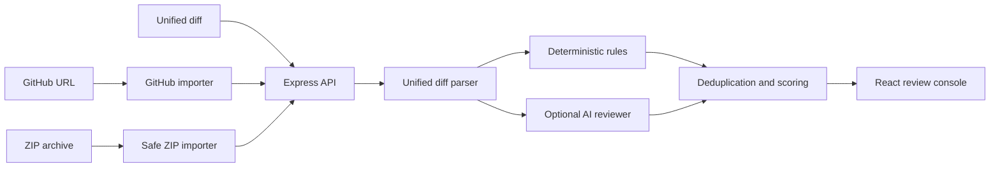

<div align="center">

# ReviewPilot

### Local-first code review with deterministic security checks and optional AI analysis.

[](https://www.typescriptlang.org/)
[](https://react.dev/)
[](https://expressjs.com/)
[](#testing)
[](#security)

[Features](#features) · [Quick start](#quick-start) · [Architecture](#architecture) · [API](#api-reference) · [Roadmap](#roadmap)

</div>

---

ReviewPilot reviews unified diffs, GitHub URLs, and ZIP archives for security, correctness, reliability, and maintainability issues. It works immediately with deterministic checks and can add semantic AI analysis using a developer-provided OpenAI API key.

It is designed as a transparent, self-hostable foundation for building a CodeRabbit-style review platform.

## Features

| Capability | Description |
| --- | --- |
| Multiple review sources | Paste a unified diff, enter a GitHub URL, or upload a ZIP project |
| Deterministic checks | Detect exposed credentials, SQL injection, unsafe evaluation, XSS, weak tokens, swallowed errors, and type-safety bypasses |
| Optional AI review | Add contextual analysis through OpenAI structured outputs |
| Line-accurate findings | Map findings to valid added lines in the submitted patch |
| Review scoring | Assign severity, category, confidence, fingerprints, file risk, and merge verdicts |
| Configurable policy | Search, filter, enable, or disable individual review rules |
| Workspace settings | Configure model, strictness, repository instructions, and finding display |
| Developer profile | Maintain local developer details and review activity |
| Responsive interface | Portal-inspired UI with keyboard support and mobile navigation |
| Privacy-first credentials | Keep OpenAI and GitHub tokens in browser session storage only |

## Supported review sources

### Unified diff

Paste a standard Git patch and provide a title and optional context. ReviewPilot analyzes added lines and preserves new-file line numbers.

### GitHub URL

ReviewPilot accepts:

- Repository URLs — reviews the latest commit on the default branch
- Pull request URLs
- Commit URLs
- Branch or tag comparison URLs

Public repositories work without authentication. Private repositories can use an optional GitHub token with read access.

### ZIP archive

Upload a ZIP project of up to 12 MB. ReviewPilot examines up to 120 supported source files and automatically excludes:

- `node_modules`, `vendor`, build output, coverage, and generated directories
- Git metadata
- Lockfiles
- Unsupported and binary files
- Unsafe archive paths

ZIP imports are snapshot reviews. Because an archive does not contain base-branch history, supported files are treated as newly added code.

## Quick start

### Requirements

- Node.js 20 or newer
- npm 10 or newer

### Installation

```bash
git clone https://github.com/YOUR_USERNAME/reviewpilot.git
cd reviewpilot
npm install
npm run dev
```

Open [http://localhost:5173](http://localhost:5173).

No API key is required for deterministic reviews. Select **Load demo PR** and then **Review this PR** to try the application.

## AI review

Select **Add API key** inside the application and enter your own OpenAI API key.

The key:

- Is stored only in the current browser tab through `sessionStorage`
- Is sent only with review requests
- Is never persisted by the ReviewPilot server
- Is redacted from returned server errors

Rules-only reviewing remains available when no API key is provided.

## Architecture



### Review pipeline

1. Validate the request and source.
2. Convert the input into a unified diff.
3. Parse changed files and added-line locations.
4. Run deterministic review rules.
5. Optionally request a structured AI review.
6. Reject findings that do not reference valid added lines.
7. Deduplicate findings and calculate file risk and merge verdict.
8. Return the result to the review console.

## Technology

### Frontend

- React 19
- TypeScript
- Vite
- Lucide icons
- Token-driven Portal-inspired design system

### Backend

- Node.js
- Express 5
- Zod request validation
- JSZip archive processing
- Multer multipart uploads
- OpenAI Responses API
- Express rate limiting

### Testing

- Vitest
- Reusable live HTTP smoke suite
- TypeScript client and server checks
- Production bundle verification

## Project structure

```text
.
├── server/
│   ├── ai-reviewer.ts       # Structured OpenAI review
│   ├── diff.ts              # Unified-diff parser
│   ├── index.ts             # Express API and validation
│   ├── review.ts            # Review orchestration and scoring
│   ├── rules.ts             # Deterministic checks
│   └── sources.ts           # GitHub and ZIP imports
├── shared/
│   └── types.ts             # Shared API contracts
├── src/
│   ├── App.tsx              # Review console and navigation
│   ├── Pages.tsx            # Rules, Settings, and Profile
│   ├── preferences.ts       # Persistent local preferences
│   ├── ruleCatalog.ts       # User-facing rule metadata
│   └── styles.css           # Portal-inspired token system
├── scripts/
│   └── smoke-test.mjs       # Live backend verification
├── DESIGN.md                # UI tokens and accessibility contract
└── GITHUB_SETUP.md          # Repository publishing guide
```

## Available commands

```bash
npm run dev      # Start the frontend and backend in development mode
npm run check    # Type-check the frontend and backend
npm test         # Run automated tests
npm run build    # Create the production client and server builds
npm start        # Start the production server
npm run smoke    # Test live backend endpoints against a running server
```

## Testing

Run the automated suite:

```bash
npm run check
npm test
npm run build
```

Run the live backend suite in a second terminal after starting the production server:

```bash
npm start
```

```bash
npm run smoke
```

The smoke suite verifies:

- Health endpoint
- Deterministic diff review
- Public GitHub repository import
- GitHub hostname and SSRF protection
- ZIP upload and dependency exclusion

## API reference

### Review a diff

```http
POST /api/reviews
Content-Type: application/json
X-OpenAI-Key: optional
```

```json
{
  "title": "Add password reset",
  "description": "Adds reset-token generation and delivery.",
  "diff": "diff --git ...",
  "settings": {
    "strictness": "balanced",
    "model": "gpt-5.6-sol",
    "instructions": "Require tests for new API routes.",
    "disabledRules": []
  }
}
```

### Review a GitHub source

```http
POST /api/sources/github
Content-Type: application/json
X-OpenAI-Key: optional
X-GitHub-Token: optional
```

```json
{
  "url": "https://github.com/owner/repository/pull/123",
  "settings": {
    "strictness": "balanced"
  }
}
```

### Review a ZIP archive

```http
POST /api/sources/zip
Content-Type: multipart/form-data
X-OpenAI-Key: optional
```

Multipart fields:

| Field | Required | Description |
| --- | --- | --- |
| `archive` | Yes | ZIP archive, maximum 12 MB |
| `settings` | No | JSON-encoded review settings |

### Health check

```http
GET /api/health
```

## Security

ReviewPilot currently includes:

- Request schema validation
- Payload and upload limits
- Per-IP rate limiting
- GitHub hostname allowlisting
- Archive path validation
- Source-file count and extracted-size limits
- Binary, dependency, generated-output, and lockfile exclusion
- API-key and token redaction in errors
- No server-side credential persistence

Before exposing ReviewPilot to public traffic:

- Add authentication and workspace authorization
- Replace the in-memory limiter with a distributed rate limiter
- Restrict CORS through `APP_ORIGIN`
- Run the service inside an isolated container
- Add encrypted persistence for review metadata
- Add audit logging without recording source or credentials

## Current limitations

- Automatic GitHub pull-request comments are not implemented yet.
- ZIP reviews analyze a source snapshot rather than a branch comparison.
- Live AI review requires the developer's OpenAI API key.
- Private GitHub imports require a token with repository read access.
- Review history and profile information are currently browser-local.

## Roadmap

- [ ] GitHub App installation and webhook support
- [ ] Automatic inline pull-request comments
- [ ] Repository-level configuration files
- [ ] Review history and team workspaces
- [ ] Incremental review updates after new commits
- [ ] Custom user-defined rules
- [ ] Review analytics and accepted-fix tracking
- [ ] Docker and hosted deployment templates

## Contributing

Contributions are welcome.

1. Fork the repository.
2. Create a feature branch.
3. Make the change.
4. Run `npm run check`, `npm test`, and `npm run build`.
5. Open a pull request describing the behavior and verification performed.

## License

No license has been selected yet. Add a license before publishing the repository as open source.

